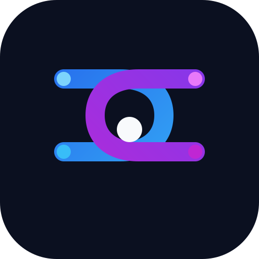

<p align="center">
  
</p>

<h1 align="center">WAM-OPD</h1>

<p align="center"><strong>On-policy distillation for joint World-Action Models</strong><br>
Teacher supervision on the states a Student actually visits.</p>

<p align="center">
  <a href="#installation">Install</a> ·
  <a href="#pipeline-at-a-glance">Pipeline</a> ·
  <a href="#verify-the-repository">Verify</a> ·
  <a href="docs/REPRODUCIBILITY.md">Reproducibility</a> ·
  <a href="#citation-and-license">Citation &amp; license</a>
</p>

> Release candidate: CPU verification and one isolated server GPU smoke test
> are passing. Full fresh-machine benchmark reproduction is **not yet
> certified**. Read [Reproducibility](docs/REPRODUCIBILITY.md) before a run.

WAM-OPD studies how a full-step LingBot-VA Teacher can improve a released,
few-step Flash-WAM Student on the states that the Student actually visits in
RoboTwin. The central object is a coherent video/action Teacher target: the
Teacher labels both modalities at the same Student history, while the Student
adapter is trained and evaluated without changing the deployment-time model
interface.

<p align="center">
  <a href="https://github.com/UCL-ERL/WAM-OPD/actions/workflows/ci.yml"></a>
  <a href="LICENSE"></a>
  
  <a href="QUALIFIED_SUCCESS_PATH_PIPELINE_V1.md">pipeline contract</a>
  · <a href="docs/REPOSITORY_LAYOUT.md">repository layout</a>
  · <a href="docs/ARTIFACT_POLICY.md">artifact policy</a>
</p>

## Why this repository

The project focuses on a practical gap in WAM post-training:

- Flash-WAM is efficient at inference but can lose closed-loop capability
  after aggressive step distillation;
- LingBot-VA provides a stronger full-step Teacher in the same RoboTwin model
  family;
- Student-controlled histories preserve the on-policy state distribution;
- joint video/action targets let the shared Transformer receive supervision
  from both world prediction and action prediction;
- exact-paired evaluation keeps seeds, initial states, prompts, noise banks,
  and task contracts fixed across model variants.

The repository contains the reproducible orchestration and model-side seams.
Large checkpoints, datasets, trajectory artifacts, logs, videos, and private
server assets stay outside Git by design.

## Pipeline at a glance

```text
qualified task contract
        │
        ▼
Student-controlled collection ──► Teacher video/action labeling
        │                                      │
        └──────────── trajectory artifacts ◄──┘
                         │
                         ▼
              JointLoRA / trajectory update
                         │
                         ▼
                 E1/E2/E3 screening
                         │
                         ▼
              selected-checkpoint receipt
                         │
                         ▼
       exact-paired Released / Adapted evaluation
```

The fixed research contract is documented in
[`QUALIFIED_SUCCESS_PATH_PIPELINE_V1.md`](QUALIFIED_SUCCESS_PATH_PIPELINE_V1.md).
Do not change split sizes, noise policies, checkpoint selection, or evaluation
semantics by editing a launcher ad hoc.

## Repository status and source of truth

The public Git repository is the portable, reviewable code surface. The
experiments that run on the research server use a larger working snapshot with
additional task-specific and diagnostic scripts. The synchronization boundary
and verification procedure are documented in
[`docs/SERVER_SOURCE_SYNC.md`](docs/SERVER_SOURCE_SYNC.md).

When a public file and the server snapshot differ, do not silently assume that
the local file is authoritative. Record the server file hash, decide whether it
is a canonical runtime surface or an internal diagnostic, then synchronize the
smallest compatible change. This keeps the repository reproducible without
publishing checkpoints or server-only paths.

## Project structure

See the [documentation map](docs/README.md) and
[`docs/REPOSITORY_LAYOUT.md`](docs/REPOSITORY_LAYOUT.md) for ownership and
compatibility rules. The short version is:

| Path | Responsibility |
| --- | --- |
| `experiments/` | Stable Python entry points, model adapters, task contracts, and focused tests. Existing module paths are compatibility-sensitive. |
| `scripts/` | Thin shell entry points and dependency bootstrap helpers. |
| `configs/` | Schemas and documentation for generated configs; generated configs are ignored. |
| `docs/method/` | Method decisions and protocol contracts. |
| `docs/deployment/` | Real-robot safety and deployment gates. |
| `repro/` | External dependency pins and source allowlists. |
| `tests/` | Repository-level contract tests. |

Files named `prototype_*`, stage diagnostics, and historical experiment
helpers remain at their established paths when external workflows may import
them. They are not default pipeline entry points; the navigation documents
identify their intended status instead of deleting them speculatively.

## Installation

Use an independent WAM-OPD Python environment. Its direct model/simulator
sources live under `third_party/lingbot-va` and
`third_party/RoboTwin-lingbot-native`; no surrounding research workspace is
required by the default installation layout.

```bash
git clone https://github.com/UCL-ERL/WAM-OPD.git
cd WAM-OPD

# Lightweight development/tests (Python 3.10–3.12; no model downloads).
python3.11 -m venv .venv
source .venv/bin/activate
python -m pip install '.[dev]'
make test

# Environment and source-tree check (does not load model weights).
wam-opd doctor
```

For GPU experiments, prepare a WAM-OPD environment with CUDA, LingBot-VA and
RoboTwin dependencies. The helper below downloads the pinned upstream source
trees directly. It does **not** install Python/CUDA packages, model weights or
simulator assets, nor does it apply the server's unpublished upstream patches.
See [Reproducibility](docs/REPRODUCIBILITY.md) for the remaining release gates.

```bash
bash scripts/bootstrap_dependencies.sh
cp .env.example .env
# Set WAM_OPD_RUNTIME_ROOT to this checkout, WAM_OPD_PYTHON_BIN to its
# .venv/bin/python, and configure the model and artifact roots.
set -a
source .env
set +a
```

The full pipeline needs these external inputs:

1. released `FlashWAM-RoboTwin` Student;
2. the official `lingbot-va-posttrain-robotwin` Teacher Transformer;
3. RoboTwin native source and assets, with LingBot-VA source;
4. a qualified task decision and outcome-free episode metadata;
5. writable artifact and scratch roots outside this repository.

The current formal validators require artifact output and qualification paths
under `/ssd/data`; arbitrary paths shown in `.env.example` are placeholders,
not a promise that every storage layout is supported.

## Verify the repository

These checks do not load models or require GPUs:

```bash
make compile
make test
```

Equivalent commands are:

```bash
python3 -m compileall -q experiments tests
python3 -m pytest -q \
  tests/test_opd_task_specs.py \
  experiments/test_qualified_success_path_pipeline.py \
  experiments/test_scaled_qualified_success_path_pipeline.py \
  experiments/test_stage_h_task_progress.py
```

Runtime tests require the pinned RoboTwin/LingBot environment:

```bash
make test-runtime

# On a prepared GPU host:
wam-opd doctor --require-gpu --require-models
```

## Run the qualified pipeline

Generate a task manifest with the binder. Generated configs belong under
`configs/generated/` and are intentionally untracked.

```bash
python3 -m experiments.bind_scaled_qualified_success_path_task \
  --task place_a2b_left \
  --metadata-source /path/to/accepted_episode_metadata.json \
  --qualification-decision /path/to/decision.json \
  --gpu-ids 0,1,2,3 \
  --noise-banks 31001 31002 32001 32002 \
  --train-count 24 \
  --calibration-count 12 \
  --screening-count 4 \
  --heldout-count 6 \
  --collection-workers-per-gpu 1 \
  --run-date YYYYMMDD

python3 -m experiments.run_scaled_qualified_success_path_pipeline validate \
  --manifest configs/generated/<task>_scaled_qualified_pipeline_v1_<date>.json

# Starts real GPU collection probes; this is NOT a dry-run.
python3 -m experiments.run_scaled_qualified_success_path_pipeline canary \
  --manifest configs/generated/<task>_scaled_qualified_pipeline_v1_<date>.json \
  --workers-per-gpu 1

python3 -m experiments.run_scaled_qualified_success_path_pipeline run \
  --manifest configs/generated/<task>_scaled_qualified_pipeline_v1_<date>.json
```

Use the configured runtime interpreter for all GPU commands above. The scaled
controller requires a canary decision and does not implement `--dry-run`.
The older shell wrapper is for the fixed 8-train/4-calibration pipeline, not
the scaled manifest above. This example ends with formal12 (6 held-out seeds
× 2 noise banks), **not** a complete paper paired60 evaluation.

The controller is fail-closed: it derives state from stage receipts, refuses
partial or ambiguous output, and never deletes or overwrites an existing
artifact root.

## Evaluation and artifacts

Formal evaluation uses exact-paired Released/Adapted units. Keep the following
outside the repository and bind them from a manifest:

- model and adapter checkpoints;
- trajectory and Teacher-label artifacts;
- frozen formal/extension protocols and noise banks;
- per-unit episode outputs and videos;
- logs, summaries, and recovery receipts.

See [`docs/ARTIFACT_POLICY.md`](docs/ARTIFACT_POLICY.md) before moving an
artifact or reusing an output root.

The stable task-generic module name is:

```bash
python3 -m experiments.run_paired_multinoise --help
```

It delegates to the existing paired evaluator and does not introduce a second
evaluation implementation.

## Real-robot safety

Start with [`docs/deployment/REAL_ROBOT_DEPLOYMENT.md`](docs/deployment/REAL_ROBOT_DEPLOYMENT.md).
This repository does not contain a verified production robot SDK adapter,
calibration layer, collision supervisor, watchdog, or E-stop integration.
Simulation success is not evidence of hardware safety. The required progression
is:

```text
offline two-chunk parity
→ WebSocket loopback
→ motors-disabled shadow mode
→ human-authorized low-speed one-chunk test
→ guarded closed-loop trials
```

## Contributing

Use the existing module paths and contracts unless a migration is explicitly
planned. Before a structural change:

1. read the relevant method and deployment contract;
2. run the baseline `make test` checks;
3. make the smallest compatible change;
4. run focused tests, then the repository checks;
5. document any server-source synchronization or artifact-format change.

The current contributor list is in [`CONTRIBUTORS.md`](CONTRIBUTORS.md).

## Citation and license

Repository code is licensed under [Apache-2.0](LICENSE). External models,
datasets, simulators, and separately distributed dependencies retain their own
licenses. The citation and final author list are deferred until release.
